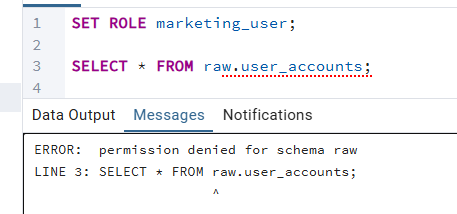
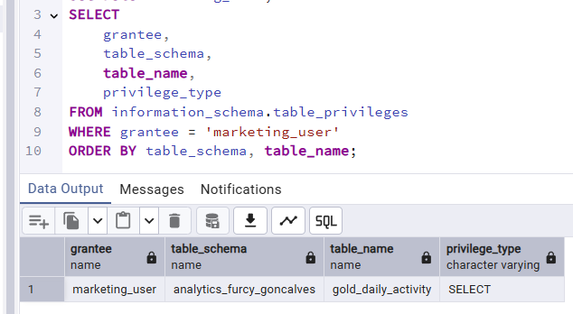

# 📊 Projet Analytics - Bike Rentals

Lien de téléchargement de l’image Docker : [docker_image_tp.zip - Google Drive](https://drive.google.com/file/d/1SCdRvAt5SD1iKmZCdsooss-M_08YHPaw/view)

## Vue d'ensemble

Ce projet implémente une architecture de données en couches (Bronze → Silver → Gold) pour l'analyse des locations de vélos avec une gouvernance des données stricte.

---

## 🗂️ Architecture des données

### Schéma créé
- **analytics_furcy_goncalves** : Schéma principal contenant les tables Silver et Gold

---

## 📋 Tables sources identifiées (Couche RAW)

| Table source | Description | Colonnes clés |
|--------------|-------------|---------------|
| `raw.user_accounts` | Comptes utilisateurs | user_id, email, birthdate, registration_date, subscription_id |
| `raw.subscriptions` | Types d'abonnements | subscription_id, sub_name, price, currency, country_scope, start_date, end_date |
| `raw.bikes` | Inventaire des vélos | bike_id, bike_type, model_name, commissioning_date, status |
| `raw.bike_stations` | Stations de vélos | station_id, station_name, latitude, longitude, capacity, city_id |
| `raw.cities` | Référentiel des villes | city_id, city_name, region, country |
| `raw.bike_rentals` | Transactions de location | rental_id, bike_id, user_id, start_station_id, end_station_id, start_t, end_t |

---

## 🔄 Couche SILVER - Traitements effectués

### 1. **silver_user_accounts**
**Source :** `raw.user_accounts`

**Traitements :**
- ✅ Filtrage des user_id et email NULL
- ✅ Nettoyage des dates de naissance aberrantes :
  - Suppression si > 100 ans
  - Suppression si date future
  - Suppression si date de naissance > date d'inscription
- ✅ Typage en DATE des colonnes birthdate et registration_date
- ✅ Exclusion des inscriptions futures
- 📌 Index créé sur user_id

### 2. **silver_subscriptions**
**Source :** `raw.subscriptions`

**Traitements :**
- ✅ Normalisation de subscription_id en minuscules
- ✅ Nettoyage du prix :
  - Suppression des symboles € et espaces
  - Remplacement virgule par point
  - Conversion en NUMERIC(10,2)
- ✅ Normalisation de la devise :
  - EUR, €, Euro → 'EUR'
  - GBP → 'GBP'
  - Prix à 0 → 'FREE'
  - Autres → 'UNKNOWN'
- ✅ Typage en DATE des colonnes start_date et end_date
- 📌 Index créé sur subscription_id

### 3. **silver_bikes**
**Source :** `raw.bikes`

**Traitements :**
- ✅ Filtrage des bike_id NULL
- ✅ Typage en DATE de commissioning_date
- 📌 Index créé sur bike_id

### 4. **silver_bike_stations**
**Source :** `raw.bike_stations`

**Traitements :**
- ✅ Nettoyage des coordonnées GPS :
  - Suppression des caractères non numériques
  - Remplacement virgule par point
  - Conversion en NUMERIC(10,6)
- ✅ Conversion de capacity en INTEGER
- 📌 Index créés sur station_id et city_id

### 5. **silver_cities**
**Source :** `raw.cities`

**Traitements :**
- ✅ Filtrage des city_id NULL
- 📌 Index créé sur city_id

### 6. **silver_bike_rentals**
**Source :** `raw.bike_rentals`

**Traitements :**
- ✅ Gestion multi-format des dates (DD/MM/YYYY et YYYY-MM-DD)
- ✅ Conversion en TIMESTAMP
- ✅ Calcul de la durée en minutes
- ✅ Filtrage des trajets aberrants :
  - Durée < 2 minutes (trajets tests)
  - Durées négatives
- 📌 Index créés sur rental_id, start_ts, user_id, bike_id, start_station_id

---

## 🏆 Couche GOLD - Table métier

### **gold_daily_activity**

**Description :** Table agrégée pour le dashboard d'activité quotidienne

**Dimensions :**
- activity_date (jour)
- city_name
- station_name
- bike_type
- sub_name (type d'abonnement)

**Métriques :**
- `total_rentals` : Nombre total de locations
- `average_duration_minutes` : Durée moyenne des trajets
- `unique_users` : Nombre d'utilisateurs uniques

**Jointures effectuées :**
```
silver_bike_rentals 
→ silver_user_accounts (via user_id)
→ silver_subscriptions (via subscription_id)
→ silver_bikes (via bike_id)
→ silver_bike_stations (via start_station_id)
→ silver_cities (via city_id)
```

📌 Index créé sur (activity_date, city_name)

---

## 🔐 Sécurité et gouvernance

### Rôle : **marketing_user**

#### Configuration
```sql
CREATE ROLE marketing_user LOGIN PASSWORD 'changeme';
GRANT USAGE ON SCHEMA analytics_furcy_goncalves TO marketing_user;
GRANT SELECT ON TABLE analytics_furcy_goncalves.gold_daily_activity TO marketing_user;
```

#### Droits accordés
- ✅ Lecture seule sur `analytics_furcy_goncalves.gold_daily_activity`

#### Droits révoqués
- ❌ Aucun accès au schéma `raw`
- ❌ Aucun accès aux tables Silver du schéma `analytics_furcy_goncalves`

---

### Rôle : **manager_lyon**

#### Configuration
```sql
CREATE ROLE manager_lyon LOGIN PASSWORD 'mgl';
GRANT USAGE ON SCHEMA analytics_furcy_goncalves TO manager_lyon;
GRANT SELECT ON TABLE analytics_furcy_goncalves.gold_daily_activity TO manager_lyon;

ALTER TABLE analytics_furcy_goncalves.gold_daily_activity ENABLE ROW LEVEL SECURITY;

CREATE POLICY lyon_only ON analytics_furcy_goncalves.gold_daily_activity
FOR SELECT TO manager_lyon
USING (city_name = 'Lyon');
```

#### Droits accordés
- ✅ Lecture sur `analytics_furcy_goncalves.gold_daily_activity`
- 🔒 **RLS activé** : Ne voit que les données où `city_name = 'Lyon'`

---

## 🧪 Audit de sécurité

### Question 1 : Que se passe-t-il si marketing_user exécute ?
```sql
SELECT * FROM raw.user_accounts;
```

**Réponse :**




---

### Question 2 : Que se passe-t-il si marketing_user exécute ?
```sql
SELECT * FROM analytics_furcy_goncalves.gold_daily_activity;
```

**Réponse :**
```
La requête s'exécute correctement
```

**Explication :** Le rôle `marketing_user` possède :
1. Le droit `USAGE` sur le schéma `analytics_furcy_goncalves`
2. Le droit `SELECT` sur la table `gold_daily_activity`

Cette requête retournera toutes les lignes de la table sans restriction.

---

## 📝 Commandes SQL d'implémentation de la sécurité

### Étape 1 : Création du rôle
```sql
CREATE ROLE marketing_user LOGIN PASSWORD 'changeme';
```

### Étape 2 : Révocation explicite des droits
```sql
-- Révocation sur le schéma raw
REVOKE ALL ON SCHEMA raw FROM marketing_user;
REVOKE ALL ON ALL TABLES IN SCHEMA raw FROM marketing_user;

-- Révocation sur toutes les tables du schéma analytics
REVOKE ALL ON SCHEMA analytics_furcy_goncalves FROM marketing_user;
REVOKE ALL ON ALL TABLES IN SCHEMA analytics_furcy_goncalves FROM marketing_user;
```

### Étape 3 : Attribution des droits minimum
```sql
-- Droit d'utiliser le schéma
GRANT USAGE ON SCHEMA analytics_furcy_goncalves TO marketing_user;

-- Droit de lecture uniquement sur la table GOLD
GRANT SELECT ON TABLE analytics_furcy_goncalves.gold_daily_activity TO marketing_user;
```

---

## ✅ Tests de sécurité

### Test 1 : Vérifier les droits du rôle
```sql
-- Se connecter en tant que marketing_user
SET ROLE marketing_user;

-- Vérifier les privilèges sur le schéma
SELECT has_schema_privilege('marketing_user', 'raw', 'USAGE');
-- Attendu: false

SELECT has_schema_privilege('marketing_user', 'analytics_furcy_goncalves', 'USAGE');
-- Attendu: true
```

### Test 2 : Vérifier les droits sur les tables
```sql
SET ROLE marketing_user;

-- Test sur raw (doit échouer)
SELECT has_table_privilege('marketing_user', 'raw.user_accounts', 'SELECT');
-- Attendu: false

-- Test sur Silver (doit échouer)
SELECT has_table_privilege('marketing_user', 'analytics_furcy_goncalves.silver_bike_rentals', 'SELECT');
-- Attendu: false

-- Test sur Gold (doit réussir)
SELECT has_table_privilege('marketing_user', 'analytics_furcy_goncalves.gold_daily_activity', 'SELECT');
-- Attendu: true
```

### Test 3 : Lister tous les privilèges du rôle
```sql
SELECT 
    grantee,
    table_schema,
    table_name,
    privilege_type
FROM information_schema.table_privileges
WHERE grantee = 'marketing_user'
ORDER BY table_schema, table_name;
```

**Résultat :** 



---

## 📌 Bonnes pratiques appliquées

1. ✅ **Principe du moindre privilège** : marketing_user n'a accès qu'à ce dont il a besoin
2. ✅ **Séparation des couches** : Raw → Silver → Gold
3. ✅ **Révocation explicite** : REVOKE ALL avant GRANT
4. ✅ **Row Level Security** : manager_lyon ne voit que Lyon
5. ✅ **Indexation** : Performance optimisée pour les requêtes analytiques
6. ✅ **Qualité des données** : Nettoyage et validation dans Silver

---

## Anomalies rencontrés 

- **98497** utilisateurs avec un abonnement Etudiant hors scope, cet abonnement à comme scope United Kingdom, sur une totalité 
  de **758492** utilisateurs ce qui représente environ **13%** des utilisateurs.
